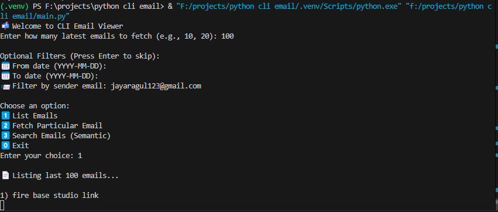

# Python CLI Email Viewer 📧

A Python-based CLI tool to interact with your IMAP email inbox. Supports:
- Listing recent emails
- Fetching a particular email by number
- Semantic search on emails using MPNet + FAISS
- Filter by sender, date ranges

## 🛠 Features
- List last N emails with optional filters (sender, date range)
- View full details of a specific email
- Semantic search with deep learning (MPNet) to find relevant emails by query
- Supports Gmail or any IMAP email server

## 🚀 Installation

1. **Clone the repository**
```bash
git clone https://github.com/Jayaragul/python-cli-email.git
cd python-cli-email

2) After this
Install dependencies
pip install -r req.txt

3) Configure Environment Variables
Create a .env file:
IMAP_USER=your-email@example.com
IMAP_PASSWORD=your-email-password-or-app-password
IMAP_HOST=imap.example.com
IMAP_PORT=993

4) then run
python main.py

 After this
Install dependencies
pip install -r req.txt

3) Configure Environment Variables
Create a .env file:
IMAP_USER=your-email@example.com
IMAP_PASSWORD=your-email-password-or-app-password
IMAP_HOST=imap.example.com
IMAP_PORT=993

4) then run
python main.py

git clone https://github.com/Jayaragul/python-cli-email.git
cd python-cli-email

2) After this
Install dependencies
pip install -r req.txt

3) Configure Environment Variables
Create a .env file:
IMAP_USER=your-email@example.com
IMAP_PASSWORD=your-email-password-or-app-password
IMAP_HOST=imap.example.com
IMAP_PORT=993

4) then run
python main.py

---

### ✅ Notes:
- Replace `image.png` with the **actual path to your image** (e.g., `assets/demo.png`).
- Make sure the image is **pushed to your GitHub repository**.

If you want me to generate a specific assets folder structure or image, let me know!


)


